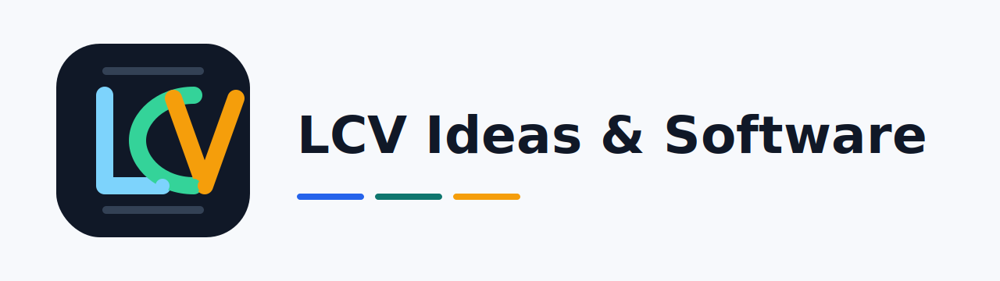

<p align="center">
  
</p>

# oraculo-financeiro

[](#status)
[](https://github.com/LCV-Ideas-Software/oraculo-financeiro/releases)
[](https://github.com/LCV-Ideas-Software/oraculo-financeiro/actions/workflows/deploy.yml)
[](https://github.com/LCV-Ideas-Software/oraculo-financeiro/actions/workflows/pages.yml)
[](https://github.com/LCV-Ideas-Software/oraculo-financeiro/actions/workflows/codeql.yml)
[](https://pages.cloudflare.com/)
[](https://react.dev/)
[](./LICENSE)

**Oráculo Financeiro** — dashboard de análise financeira focado em renda fixa indexada à inflação (LCI/CDB com IPCA+, Tesouro IPCA+ etc.) com análise contextual via Gemini AI. React 19 + Vite 8 sobre Cloudflare Pages com D1 backing store + Cron Worker auxiliar para pre-warming de cache de taxa.

**Status.** Stable. Current release: **v01.10.07**. See [CHANGELOG.md](./CHANGELOG.md) for the full release history.

The version history at a glance:

| Release         | Scope                                                                                                                                                                                                                                                                                                                                                             |
| --------------- | ----------------------------------------------------------------------------------------------------------------------------------------------------------------------------------------------------------------------------------------------------------------------------------------------------------------------------------------------------------------- |
| **`v01.10.07`** | **4-gate quality directive compliance.** Added Biome scripts, deploy workflow coverage after eslint, scoped Biome to source/functions, and applied cosmetic source formatting plus safe callback cleanup required by the gate.                                                                                |
| **`v01.10.06`** | **npm registry split for StepSecurity.** Operational Wrangler scripts now force the public npm registry for `npx` while preserving the StepSecurity proxy for dependency install/update flows.                                                                                                      |
| **`v01.10.05`** | **Site sponsor card iteration.** `site/index.html` GitHub Sponsors iframe (caixa branca cross-origin) substituído por link card dark navy com ❤ pink + meta cyan + seta animada; card movido para DEPOIS dos botões (lcv.dev/sponsor primário, GitHub Sponsors alternativa). Companion ship Phase 3 (12 repos).                                                   |
| **`v01.10.04`** | **Site visual identity refresh.** `site/index.html` (GitHub Pages) reskinneada para a nova identidade dark-first navy/cyan da org LCV (`#050b18`/`#38bdf8`/`#34d399`, gradientes radiais, glow shadows, gradient text no h1). Coordinated Phase 2 companion ship (calculadora, oraculo, astrologo, admin, mainsite, maestro, mtasts). Sem mudança no app runtime. |
| **`v01.10.03`** | **README organizational standardization.** Adopted the shared repository README opening pattern, corrected public release and clone links to the organization, surfaced the top-level version-history table, and kept the GitHub Sponsors link on `example-beneficiary` by explicit beneficiary decision.                                                                     |
| **`v01.10.02`** | **Pages modernization.** Migrated fully to the current GitHub Pages artifact-deployment model and enabled idempotent Pages setup for fresh clones/forks.                                                                                                                                                                                                          |
| **`v01.10.01`** | **Public flip prep.** Finalized repo-publication hygiene, D1 placeholder injection, Cron trigger versioning, bootstrap consistency, and parser-based HTML sanitization.                                                                                                                                                                                           |
| **`v01.10.00`** | **Critical runtime fixes.** Fixed same-origin GET origin handling, stabilized JSON error responses in auth handlers, and improved public endpoint resilience.                                                                                                                                                                                                     |

## What it does

Aplicação para analisar e comparar produtos de renda fixa atrelados ao IPCA:

1. **Coleta**: usuário registra LCIs/CDBs (taxa de juro real + vencimento + emissor + valor) e/ou consulta o Tesouro Direto.
2. **Cálculo determinístico** (`functions/api/registros-lci-cdb.ts`, `functions/api/tesouro-ipca.ts`): cálculo de rentabilidade real, projeção até vencimento usando IPCA atual.
3. **Análise por IA** (`functions/api/analisar-ia.ts`, `functions/api/auditorias-ia.ts`): Gemini 2.5 Pro recebe os números calculados + contexto macro e produz insights executivos sem invenção.
4. **Cache + auditoria**: D1 mantém cache de taxa IPCA + registros do usuário + log de auditorias IA.
5. **Cron Worker** (`workers/taxaipca-motor`): pre-warm diário (02h BRT) de cache IPCA+ a partir do CSV do Tesouro Transparente, garantindo que requests síncronos não dependam de fetch live.

Funcionalidades adicionais:

- **Auth opcional** (`oraculo-auth.ts`): resgate por e-mail/código para recuperar registros previamente salvos.
- **Compartilhamento via e-mail** (`enviar-email.ts`) com sanitização parser-based (sanitize-html).
- **Rate limiting por D1** (`_shared/security.ts`): proteção contra abuso de endpoints públicos.

## Architecture

```
Browser -> Cloudflare Pages (React build)
                |
                v
       client-side fetch to /api/*
                |
                v
   Cloudflare Pages Functions (functions/api/*)
                |                       |
                v                       v
            D1: BIGDATA_DB        External APIs:
            (oraculo_*            - Tesouro Transparente CSV
             tables: registros,   - Gemini AI
             auditorias, cache,
             rate limit, sessões)
                ^
                |
       Cloudflare Worker (cron)
       workers/taxaipca-motor
       (pre-warm cache 02h BRT)
```

## Deploy your own fork

You will need:

- A Cloudflare account ([free tier](https://www.cloudflare.com/plans/)) with Pages + D1 + Workers enabled.
- The Cloudflare CLI [`wrangler`](https://developers.cloudflare.com/workers/wrangler/).
- Node.js 22+.
- A Google AI Studio API key for Gemini integration.

### 1. Clone + install

```bash
git clone https://github.com/LCV-Ideas-Software/oraculo-financeiro.git
cd oraculo-financeiro
npm ci
```

### 2. Create your D1 database

```bash
npx wrangler d1 create example_db
# wrangler outputs:
#   database_id = "xxxxxxxx-xxxx-xxxx-xxxx-xxxxxxxxxxxx"
```

### 3. Wire the database_id into both wrangler.json files

Replace the placeholder `00000000-0000-0000-0000-000000000000` in:

- `wrangler.json` (Pages app at root)
- `workers/taxaipca-motor/wrangler.json` (Cron Worker — same D1 binding)

```jsonc
{
  "d1_databases": [
    {
      "binding": "BIGDATA_DB",
      "database_name": "example_db",
      "database_id": "<your-d1-id-from-step-2>",
    },
  ],
}
```

There is also a helper script `npm run d1:setup` that automates wrangler.json mutation + schema apply for fresh forks.

### 4. Apply schema

```bash
npx wrangler d1 execute example_db --remote --file db/001_init.sql
npx wrangler d1 execute example_db --remote --file db/002_tesouro_ipca_lotes.sql
```

Or run `npm run d1:setup` which wraps both.

### 5. Configure secrets

```bash
npx wrangler secret put GEMINI_API_KEY --env production
npx wrangler secret put RESEND_APPKEY --env production  # only if using email feature
```

### 6. Build + deploy

```bash
npm run build
npx wrangler pages deploy dist --project-name=oraculo-financeiro
npx wrangler deploy --config workers/taxaipca-motor/wrangler.json
```

The Pages app and the Cron Worker are deployed independently but share the same D1 binding.

## CI deploy (this repo)

This repo's [`.github/workflows/deploy.yml`](.github/workflows/deploy.yml) runs on every push to `main`. Steps: setup-node 24 → npm install + build → `jq` substitution to inject `D1_DATABASE_ID` from secret into BOTH `wrangler.json` files (root + `workers/taxaipca-motor/`) → `wrangler pages deploy` (Pages) → `wrangler deploy --config workers/taxaipca-motor/wrangler.json` (Cron Worker). Real D1 ID kept out of git, lives only as a GitHub Actions secret.

## Repository conventions

- **License**: [AGPL-3.0-or-later](./LICENSE). Network-service trigger applies: running a modified fork as a public service obligates you to publish modifications.
- **Notices**: see [NOTICE](./NOTICE) and [THIRDPARTY](./THIRDPARTY.md).
- **Security disclosure**: see [SECURITY.md](./SECURITY.md).
- **Code of conduct**: see [CODE_OF_CONDUCT.md](./CODE_OF_CONDUCT.md).
- **Changelog**: [CHANGELOG.md](./CHANGELOG.md).
- **Contributing**: see [CONTRIBUTING.md](./CONTRIBUTING.md).
- **Sponsorship**: see the repo's `Sponsor` button or [central sponsor page](https://www.lcv.dev/sponsor).
- **Action pinning**: all GitHub Actions are pinned by full SHA per supply-chain hardening baseline.
- **Code owners**: [.github/CODEOWNERS](.github/CODEOWNERS).

## Links

- Site: [https://oraculo-financeiro-app.lcv.dev](https://oraculo-financeiro-app.lcv.dev)
- GitHub: [https://github.com/LCV-Ideas-Software/oraculo-financeiro](https://github.com/LCV-Ideas-Software/oraculo-financeiro)
- Sponsors: [https://github.com/sponsors/LCV-Ideas-Software](https://github.com/sponsors/LCV-Ideas-Software)

## License

AGPL-3.0-or-later. See [LICENSE](./LICENSE), [NOTICE](./NOTICE), and [THIRDPARTY](./THIRDPARTY.md).

---

<p align="center"><span style="font-size: 1.5em;"><strong>Copyright © 2026 LCV Ideas &amp; Software</strong></span><br><sub>LEONARDO CARDOZO VARGAS TECNOLOGIA DA INFORMACAO LTDA<br>Rua Pais Leme, 215 Conj 1713 - Pinheiros<br>São Paulo - SP<br>CEP 05424-150<br>CNPJ: 66.584.678/0001-77<br>IM 3039854</sub></p>
